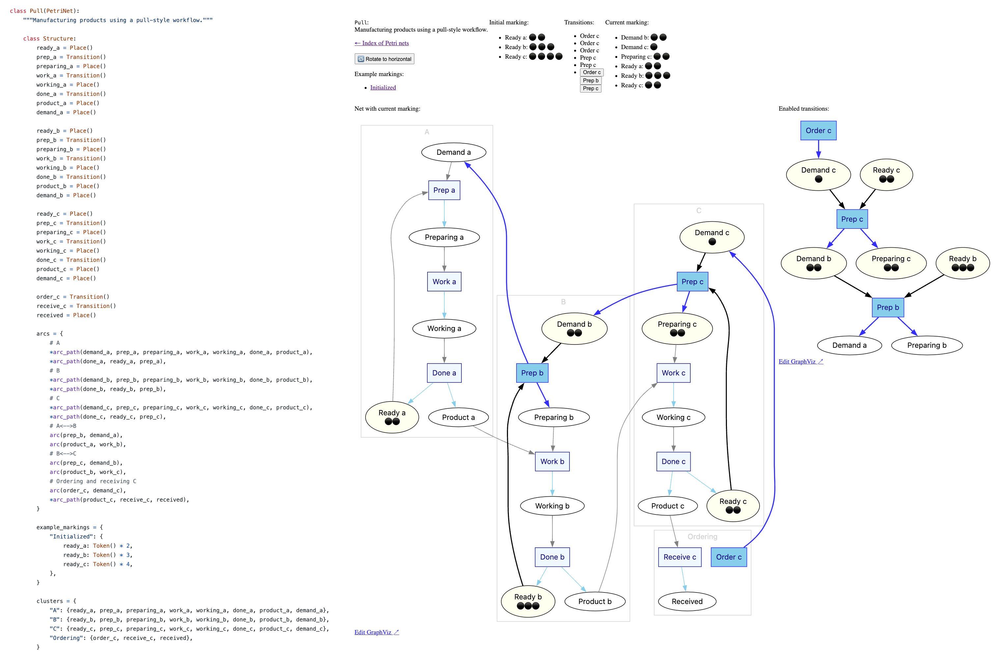

# CarlAdam: Petri net tools and interactive simulator for Python

## What is a Petri net?

Petri nets are a mathematical modeling scheme for the description of distributed systems.

Petri nets were invented in 1962 by Carl Adam Petri.
They have been used to model various kinds of systems,
including computer networks, manufacturing systems, and biological systems.

## What is CarlAdam?

`CarlAdam` is a Python library for working with Petri nets, named after their inventor.
It provides a simple, Python-oriented API for defining and manipulating Petri nets.

It is also a simulator for Petri nets, so you can run your Petri net models and see how they behave.

## Example

Here is an example of a Petri net being used to model a simple pull-style production workflow.
It models three stages, each with their own capacity.
Each stage signals demand for intermediate products they need,
and provides products their own work is done.



## Running the simulator

The above example and more are included, and can all be interacted with by cloning this repo.

Use Docker, which runs the required
[Kroki](https://kroki.io) and [Niolesk](https://niolesk.top) services locally as well:

```shell
$ docker compose up
```

Or, run the simulator directly, which uses the public Kroki and Niolesk websites by default:

```shell
$ poetry install
$ make simulator
```

Then browse to http://localhost:8000 to see the simulator in action.

## Using as a library

Petri net functionality can be included in your own code.
Just add `CarlAdam` as a dependency.

```pycon
>>> from carladam import PetriNet, Place, Token, Transition, arc_path

>>> class MyNet(PetriNet):
...     class Structure:
...         on = Place()
...         off = Place()
...         turn_on = Transition()
...         turn_off = Transition()
...         arcs = {*arc_path(turn_on, on, turn_off, off, turn_on)}

>>> net = MyNet.new()
>>> ns = net.Structure

>>> ns.arcs
{□ Turn on → ⬭ On, □ Turn off → ⬭ Off, ⬭ Off → □ Turn on, ⬭ On → □ Turn off}

>>> before = {ns.on: {Token()}}
>>> before
{⬭ On: {⚫️}}

>>> list(net.enabled_transitions(before))
[□ Turn off]

>>> after = net.marking_after_transition(before, ns.turn_off)
>>> after
pmap({⬭ Off: pset([⚫️])})
```

## Using in a Jupyter notebook

You can also include Petri net diagrams in Jupyter notebooks.

More documentation will be provided for this in a future release.

## Sponsors

Initial work on the CarlAdam package was sponsored by [Routable](https://routable.com/).
